🔄 Luồng Hoạt Động Dự Án Website Bán Hàng Mini
📊 Tổng Quan Kiến Trúc
Website Bán Hàng Mini được xây dựng theo mô hình client-server với kiến trúc hiện đại:

Frontend: React + TypeScript + Zustand
Backend: Node.js + Express + PostgreSQL
External Services: Stripe Payment, Gemini AI
🚀 Luồng Hoạt Động Chính
1. 👤 Xác Thực Người Dùng
Đăng ký tài khoản:

User nhập thông tin đăng ký (email, password, name)
Frontend validate form và gửi request đến /api/auth/register
Backend kiểm tra email đã tồn tại chưa
Backend mã hóa password với bcrypt
Backend lưu thông tin user vào database
Backend tạo JWT token và trả về
Frontend lưu token vào localStorage
User được chuyển đến trang chính
Đăng nhập:

User nhập email và password
Frontend gửi request đến /api/auth/login
Backend kiểm tra thông tin đăng nhập
Backend tạo JWT token và trả về
Frontend lưu token vào localStorage
User được chuyển đến trang chính
2. 🛍️ Xem và Tìm Kiếm Sản Phẩm
Xem danh sách sản phẩm:

Frontend gửi request đến /api/products với các tham số filter
Backend truy vấn database với các điều kiện filter
Backend trả về danh sách sản phẩm và metadata (total, pagination)
Frontend render sản phẩm với lazy loading images
Tìm kiếm sản phẩm:

User nhập từ khóa tìm kiếm
Frontend gửi request đến /api/products/search
Backend thực hiện full-text search
Backend trả về kết quả tìm kiếm
Frontend hiển thị kết quả
Xem chi tiết sản phẩm:

User click vào sản phẩm
Frontend gửi request đến /api/products/:id
Backend truy vấn sản phẩm và các thông tin liên quan (variants, reviews)
Backend trả về thông tin chi tiết sản phẩm
Frontend render trang chi tiết sản phẩm
3. 🛒 Giỏ Hàng và Checkout
Thêm sản phẩm vào giỏ hàng:

User chọn sản phẩm, variant và số lượng
Frontend thêm sản phẩm vào cart store (Zustand)
Frontend lưu giỏ hàng vào localStorage
UI cập nhật hiển thị số lượng sản phẩm trong giỏ
Quản lý giỏ hàng:

User xem giỏ hàng
Frontend hiển thị sản phẩm từ cart store
User có thể thay đổi số lượng hoặc xóa sản phẩm
Frontend cập nhật cart store và localStorage
Frontend tính toán tổng tiền, thuế, phí vận chuyển
Checkout:

User tiến hành thanh toán
Frontend hiển thị form thông tin giao hàng
User điền thông tin và chọn phương thức thanh toán
Frontend gửi request đến /api/orders/create
Backend tạo đơn hàng tạm thời trong database
Backend tạo Stripe Payment Intent
Backend trả về client secret
Frontend hiển thị form thanh toán Stripe
User hoàn tất thanh toán
Stripe callback đến backend
Backend cập nhật trạng thái đơn hàng
Frontend hiển thị trang xác nhận đơn hàng
4. 👨‍💼 Quản Lý Admin
Đăng nhập admin:

Admin truy cập /admin
Admin đăng nhập với tài khoản admin
Backend kiểm tra quyền admin
Backend trả về token với role admin
Frontend chuyển đến dashboard admin
Quản lý sản phẩm:

Admin xem danh sách sản phẩm
Admin có thể thêm, sửa, xóa sản phẩm
Admin upload hình ảnh sản phẩm
Backend lưu hình ảnh và cập nhật database
Admin có thể quản lý variants và attributes
Quản lý đơn hàng:

Admin xem danh sách đơn hàng
Admin có thể cập nhật trạng thái đơn hàng
Backend cập nhật database và gửi email thông báo
Admin có thể xem chi tiết đơn hàng
Xem báo cáo:

Admin truy cập dashboard
Backend tính toán các metrics (doanh thu, đơn hàng, sản phẩm bán chạy)
Backend trả về dữ liệu báo cáo
Frontend hiển thị charts và statistics
5. 🤖 Tương Tác với AI Chatbot
Khởi tạo chatbot:

User truy cập website
Frontend kiểm tra Gemini API key
Nếu có key, chatbot hiển thị "Gemini AI Active"
Nếu không có key, chatbot hiển thị "Demo Mode"
Tương tác với chatbot:

User click vào icon chat
Frontend hiển thị chat widget
User gửi câu hỏi
Frontend gửi request đến /api/chat/message
Backend lấy context sản phẩm từ database
Backend gửi prompt + context đến Gemini API
Gemini AI trả về response
Backend format và trả về cho frontend
Frontend hiển thị response trong chat widget
Fallback mode:

Nếu Gemini API không hoạt động
Backend sử dụng mock responses
Frontend hiển thị "Demo Mode"
🔄 Data Flow
Frontend → Backend
API Requests: Frontend gửi HTTP requests đến backend API

Authentication header với JWT token
Request body với data (JSON)
Query parameters cho filtering, sorting, pagination
File Uploads: Frontend gửi multipart/form-data

Product images
User avatars
WebSockets: Real-time updates (nếu có)

Order status updates
Chat messages
Backend → Database
CRUD Operations: Backend thực hiện các thao tác CRUD

Create: INSERT queries
Read: SELECT queries với JOIN
Update: UPDATE queries
Delete: DELETE queries (hoặc soft delete)
Transactions: Đảm bảo tính toàn vẹn dữ liệu

Order creation
Inventory updates
Migrations: Cập nhật schema database

Add/modify tables
Add/modify columns
Backend → External Services
Payment Processing: Tích hợp với Stripe

Create payment intents
Handle webhooks
Process refunds
AI Integration: Tích hợp với Gemini AI

Send prompts
Receive responses
Context management
Email Service: Gửi email thông báo

Order confirmations
Password resets
Marketing emails
🔒 Security Flow
Authentication:

JWT tokens với expiration
Refresh token mechanism
Secure HTTP-only cookies
Authorization:

Role-based access control (RBAC)
Permission checks trong middlewares
Protected routes
Data Protection:

Input validation
SQL injection prevention
XSS protection
CSRF protection
🚀 Deployment Flow
Development:

Local development với hot reloading
Environment variables cho configuration
Testing:

Unit tests cho components và services
Integration tests cho API endpoints
E2E tests cho user flows
Production:

Build optimized bundles
Serve static assets từ CDN
Database migrations
Environment-specific configuration
📱 Responsive Design Flow
Mobile First:

Design bắt đầu từ mobile
Progressive enhancement cho larger screens
Breakpoints:

Small: < 640px (mobile)
Medium: 640px - 768px (tablet portrait)
Large: 768px - 1024px (tablet landscape)
XL: 1024px - 1280px (desktop)
2XL: > 1280px (large desktop)
Layout Adjustments:

Stack layout trên mobile
Grid layout trên desktop
Collapsible navigation trên mobile
Sidebar navigation trên desktop
🌐 Internationalization (i18n) Flow
Language Detection:

Auto-detect từ browser settings
User có thể override
Translation Loading:

Lazy load translation files
Fallback đến default language
Content Rendering:

Translate text với i18n hooks
Format dates, numbers, currencies theo locale
🎯 Tóm Tắt Luồng Hoạt Động
User Access: User truy cập website
Authentication: User đăng nhập/đăng ký
Product Browsing: User xem và tìm kiếm sản phẩm
Shopping Cart: User thêm sản phẩm vào giỏ hàng
Checkout: User tiến hành thanh toán
Order Confirmation: User nhận xác nhận đơn hàng
Admin Management: Admin quản lý sản phẩm, đơn hàng
AI Assistance: Chatbot hỗ trợ user trong quá trình mua sắm
Mỗi bước trong luồng hoạt động đều được thiết kế để tối ưu trải nghiệm người dùng, đảm bảo hiệu suất và bảo mật.


# 🔄 Sơ Đồ Luồng Hoạt Động Dự Án

## 📊 Tổng Quan Kiến Trúc

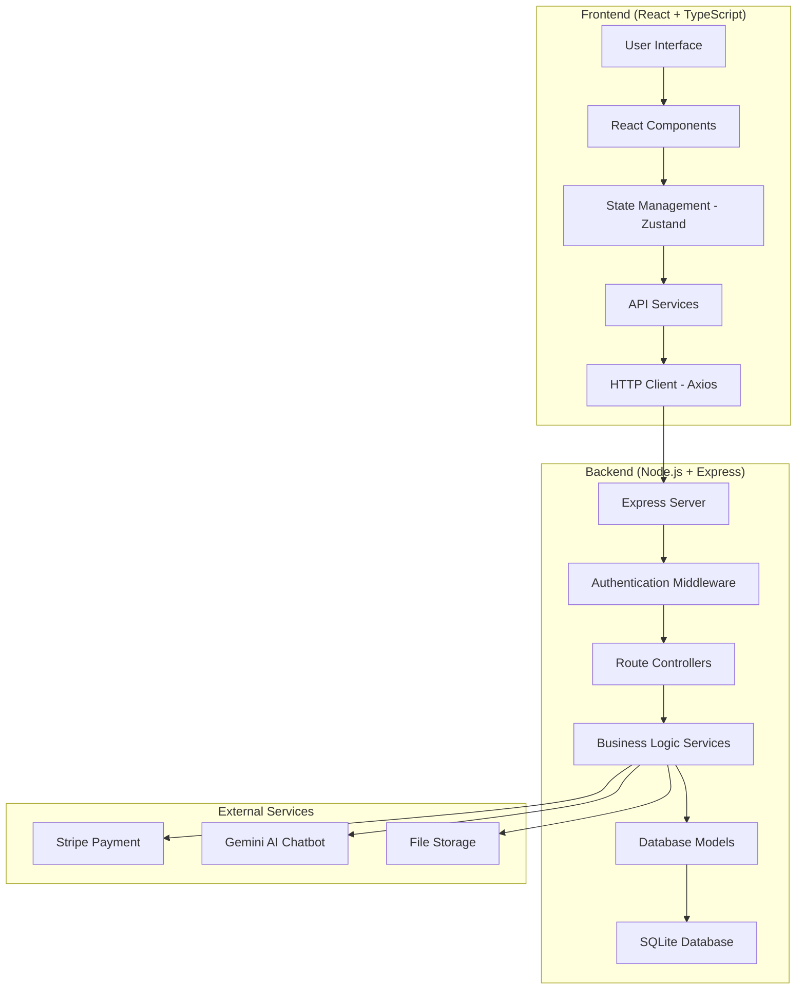

## 🚀 Luồng Hoạt Động Chính

### 1. 👤 Xác Thực Người Dùng

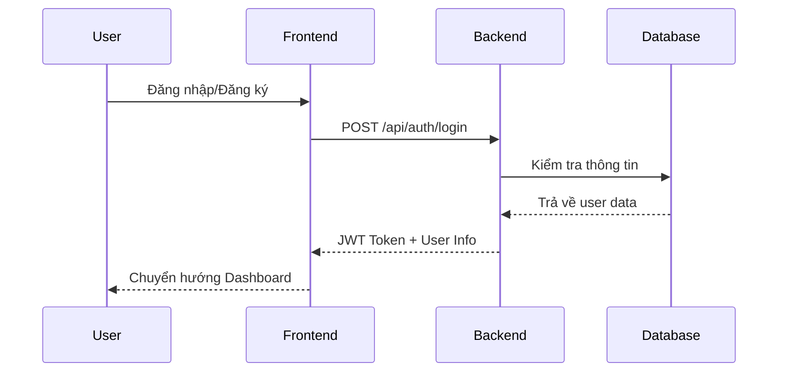

### 2. 🛍️ Quản Lý Sản Phẩm

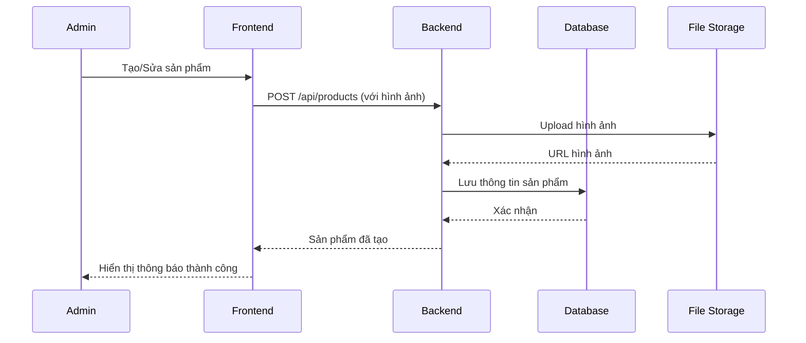

### 3. 🛒 Quy Trình Mua Hàng

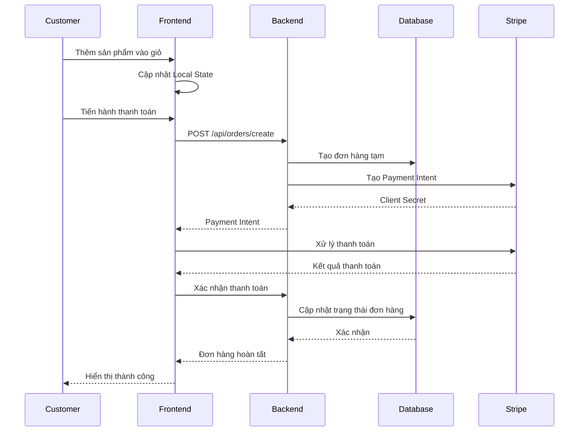

### 4. 🤖 Chatbot Hỗ Trợ

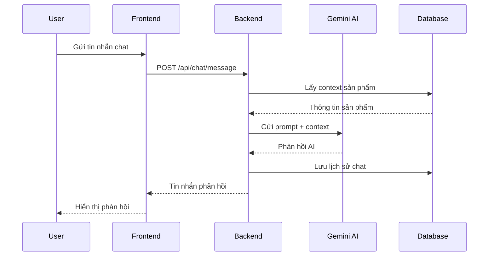

## 🏗️ Kiến Trúc Chi Tiết

### Frontend Architecture

```
src/
├── components/          # UI Components tái sử dụng
│   ├── common/         # Button, Input, Modal...
│   ├── layout/         # Header, Footer, Sidebar
│   └── forms/          # Form components
├── pages/              # Các trang chính
│   ├── auth/           # Login, Register
│   ├── shop/           # Product listing, detail
│   ├── admin/          # Admin dashboard
│   └── checkout/       # Cart, Payment
├── store/              # Zustand state management
├── services/           # API calls
├── hooks/              # Custom React hooks
├── utils/              # Helper functions
└── types/              # TypeScript definitions
```

### Backend Architecture

```
src/
├── controllers/        # Route handlers
│   ├── auth.js        # Authentication
│   ├── products.js    # Product management
│   ├── orders.js      # Order processing
│   └── chat.js        # Chatbot
├── middlewares/        # Express middlewares
│   ├── auth.js        # JWT verification
│   ├── upload.js      # File upload
│   └── validation.js  # Input validation
├── models/            # Database models
├── services/          # Business logic
├── routes/            # API routes
└── utils/             # Helper functions
```

## 🔐 Bảo Mật & Xác Thực

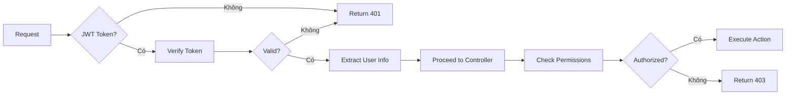

## 📱 Responsive Design Flow

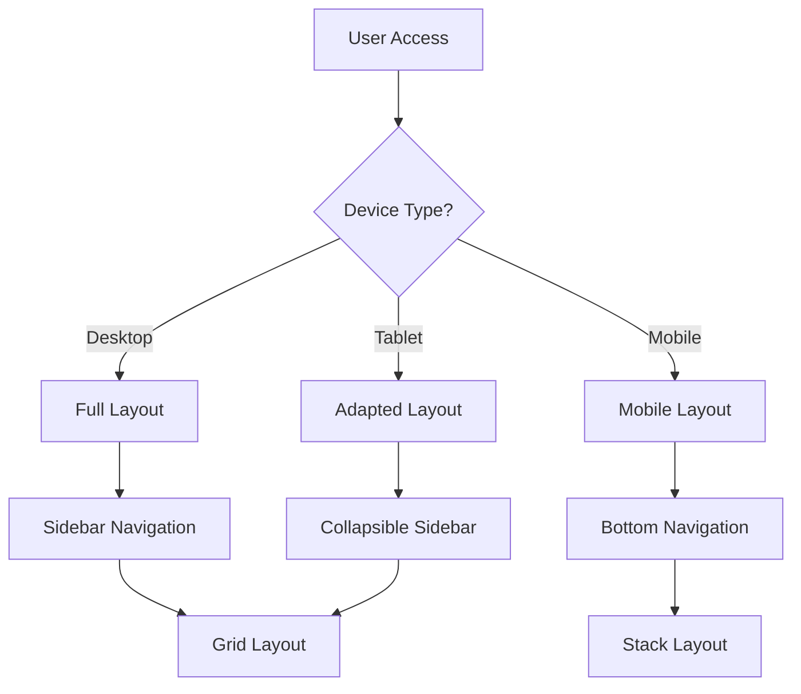

## 🌐 Đa Ngôn Ngữ (i18n)

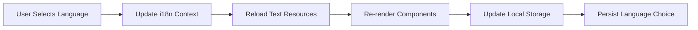

## 📊 Quản Lý Trạng Thái

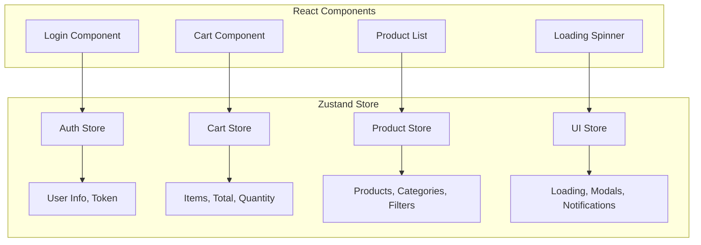

## 🚀 Deployment Flow

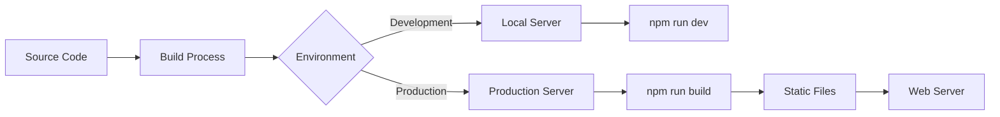

## 📈 Performance Optimization

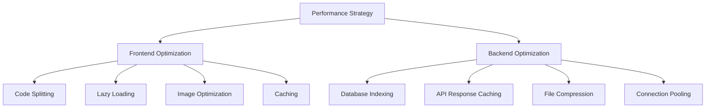

## 🔄 Data Flow Summary

1. **User Interaction** → Frontend captures user actions
2. **State Management** → Zustand manages application state
3. **API Calls** → Frontend communicates with backend via REST API
4. **Authentication** → JWT tokens secure all requests
5. **Business Logic** → Backend processes requests and applies business rules
6. **Database Operations** → SQLite stores and retrieves data
7. **External Services** → Integration with Stripe and Gemini AI
8. **Response** → Data flows back to frontend and updates UI

Sơ đồ này cho thấy dự án được thiết kế với kiến trúc hiện đại, bảo mật cao và dễ mở rộng.


# 📁 Cấu Trúc Dự Án Website Bán Hàng Mini

## 🔍 Tổng Quan

Website Bán Hàng Mini được xây dựng theo kiến trúc client-server với hai phần chính:

- **Frontend**: React + TypeScript + Vite
- **Backend**: Node.js + Express + PostgreSQL

## 📂 Cấu Trúc Frontend

```
frontend/
├── public/                 # Static assets
│   ├── images/             # Hình ảnh tĩnh
│   ├── admin/              # Admin panel assets
│   └── favicon.ico         # Favicon
├── src/                    # Source code
│   ├── assets/             # Dynamic assets
│   ├── components/         # React components
│   │   ├── common/         # Common UI components
│   │   ├── layout/         # Layout components
│   │   └── forms/          # Form components
│   ├── config/             # Configuration files
│   ├── constants/          # Constants and enums
│   ├── contexts/           # React contexts
│   ├── data/               # Static data
│   ├── features/           # Feature modules
│   │   ├── auth/           # Authentication
│   │   ├── cart/           # Shopping cart
│   │   ├── products/       # Product management
│   │   ├── checkout/       # Checkout process
│   │   └── ai-chatbot/     # Gemini AI chatbot
│   ├── hooks/              # Custom React hooks
│   ├── lib/                # Third-party libraries
│   ├── locales/            # i18n translations
│   ├── pages/              # Page components
│   ├── routes/             # Routing configuration
│   ├── services/           # API services
│   ├── store/              # State management
│   ├── styles/             # Global styles
│   ├── types/              # TypeScript types
│   ├── utils/              # Utility functions
│   ├── App.tsx             # Main App component
│   └── main.tsx            # Entry point
├── .env.example            # Environment variables example
├── package.json            # Dependencies and scripts
├── tailwind.config.js      # Tailwind CSS configuration
├── tsconfig.json           # TypeScript configuration
└── vite.config.ts          # Vite configuration
```

### 🔑 Thành Phần Chính Frontend

1. **Components**: Các thành phần UI tái sử dụng

   - `common`: Button, Input, Modal, Card...
   - `layout`: Header, Footer, Sidebar...
   - `forms`: Form components với validation

2. **Pages**: Các trang chính của ứng dụng

   - Home, Shop, Product Detail, Cart, Checkout...
   - Admin Dashboard, Product Management...

3. **Store**: Quản lý state với Zustand

   - `authStore`: Quản lý authentication
   - `cartStore`: Quản lý giỏ hàng
   - `productStore`: Quản lý sản phẩm
   - `uiStore`: Quản lý UI state

4. **Services**: Giao tiếp với backend API

   - `api.ts`: Axios instance và interceptors
   - `authService.ts`: Authentication API
   - `productService.ts`: Product API
   - `orderService.ts`: Order API

5. **Features**: Module hóa các tính năng
   - Mỗi feature có components, hooks, services riêng
   - Tách biệt logic business và UI

## 📂 Cấu Trúc Backend

```
backend/
├── scripts/                # Database scripts
│   ├── seed-database.js    # Seed data script
│   └── import-hybrid-products.js # Import products
├── src/                    # Source code
│   ├── config/             # Configuration
│   ├── constants/          # Constants
│   ├── controllers/        # Route controllers
│   │   ├── auth.js         # Authentication
│   │   ├── products.js     # Products
│   │   ├── orders.js       # Orders
│   │   └── admin.js        # Admin
│   ├── database/           # Database setup
│   ├── middlewares/        # Express middlewares
│   │   ├── auth.js         # Authentication
│   │   ├── validation.js   # Input validation
│   │   └── upload.js       # File upload
│   ├── migrations/         # Database migrations
│   ├── models/             # Database models
│   │   ├── user.js         # User model
│   │   ├── product.js      # Product model
│   │   ├── order.js        # Order model
│   │   └── category.js     # Category model
│   ├── routes/             # API routes
│   │   ├── auth.js         # Auth routes
│   │   ├── products.js     # Product routes
│   │   ├── orders.js       # Order routes
│   │   └── admin.js        # Admin routes
│   ├── services/           # Business logic
│   │   ├── auth.js         # Auth service
│   │   ├── product.js      # Product service
│   │   ├── order.js        # Order service
│   │   └── ai.js           # AI service
│   ├── utils/              # Utility functions
│   ├── validators/         # Input validators
│   ├── app.js              # Express app
│   └── server.js           # Server entry point
├── uploads/                # Uploaded files
│   ├── products/           # Product images
│   └── users/              # User avatars
├── .env.example            # Environment variables example
└── package.json            # Dependencies and scripts
```

### 🔑 Thành Phần Chính Backend

1. **Controllers**: Xử lý requests và responses

   - Nhận request từ client
   - Gọi services để xử lý business logic
   - Trả về response cho client

2. **Services**: Xử lý business logic

   - Tách biệt logic khỏi controllers
   - Tương tác với models để CRUD data
   - Xử lý các nghiệp vụ phức tạp

3. **Models**: Định nghĩa cấu trúc dữ liệu

   - Sử dụng Sequelize ORM
   - Định nghĩa relationships giữa các models
   - Validation data

4. **Routes**: Định nghĩa API endpoints

   - RESTful API design
   - Grouping routes theo tính năng
   - Middleware authentication và validation

5. **Middlewares**: Xử lý trước/sau requests
   - Authentication với JWT
   - Validation input
   - Error handling
   - File upload

## 🗄️ Cấu Trúc Database

### 📊 Entity Relationship Diagram (ERD)

```
┌─────────────┐       ┌─────────────┐       ┌─────────────┐
│   Users     │       │  Products   │       │ Categories  │
├─────────────┤       ├─────────────┤       ├─────────────┤
│ id          │       │ id          │       │ id          │
│ email       │       │ name        │       │ name        │
│ password    │       │ description │       │ description │
│ name        │       │ price       │       │ image       │
│ role        │       │ stock       │       │ slug        │
│ avatar      │       │ categoryId  │─────┐ │ createdAt   │
│ createdAt   │       │ images      │     └─│ updatedAt   │
│ updatedAt   │       │ variants    │       └─────────────┘
└─────────────┘       │ attributes  │
        │             │ createdAt   │       ┌─────────────┐
        │             │ updatedAt   │       │  Reviews    │
        │             └─────────────┘       ├─────────────┤
        │                     │             │ id          │
        │                     └────────────┐│ rating      │
        │                                  ││ comment     │
┌─────────────┐       ┌─────────────┐     ││ userId      │─┐
│   Orders    │       │ OrderItems  │     ││ productId   │┐│
├─────────────┤       ├─────────────┤     ││ createdAt   │││
│ id          │       │ id          │     ││ updatedAt   │││
│ userId      │───────│ orderId     │     │└─────────────┘││
│ status      │       │ productId   │─────┘               ││
│ total       │       │ quantity    │                     ││
│ address     │       │ price       │                     ││
│ paymentId   │       │ variantId   │                     ││
│ createdAt   │       │ createdAt   │                     ││
│ updatedAt   │       │ updatedAt   │                     ││
└─────────────┘       └─────────────┘                     ││
        │                                                 ││
        └─────────────────────────────────────────────────┘│
                                                           │
                                                           │
┌─────────────┐       ┌─────────────┐                      │
│  Variants   │       │ Attributes  │                      │
├─────────────┤       ├─────────────┤                      │
│ id          │       │ id          │                      │
│ productId   │       │ name        │                      │
│ name        │       │ value       │                      │
│ price       │       │ productId   │                      │
│ stock       │       │ createdAt   │                      │
│ attributes  │       │ updatedAt   │                      │
│ createdAt   │       └─────────────┘                      │
│ updatedAt   │                                            │
└─────────────┘                                            │
                                                           │
┌─────────────┐                                            │
│  Wishlist   │                                            │
├─────────────┤                                            │
│ id          │                                            │
│ userId      │────────────────────────────────────────────┘
│ productId   │
│ createdAt   │
│ updatedAt   │
└─────────────┘
```

### 📝 Các Bảng Chính

1. **Users**: Người dùng và admin

   - Roles: customer, admin
   - Authentication với JWT

2. **Products**: Sản phẩm

   - Variants: các biến thể sản phẩm (size, color, etc.)
   - Attributes: thuộc tính động của sản phẩm
   - Images: gallery hình ảnh

3. **Categories**: Danh mục sản phẩm

   - Hierarchical structure (parent-child)

4. **Orders**: Đơn hàng

   - OrderItems: Chi tiết đơn hàng
   - Payment information

5. **Reviews**: Đánh giá sản phẩm
   - Rating và comments

## 🔄 Luồng Hoạt Động Chính

### 1. Đăng Ký/Đăng Nhập

- User đăng ký tài khoản
- Backend validate và lưu thông tin
- JWT token được tạo và trả về
- Frontend lưu token trong localStorage
- Subsequent requests sử dụng token

### 2. Xem Sản Phẩm

- Frontend gọi API lấy danh sách sản phẩm
- Backend truy vấn database và trả về
- Frontend render sản phẩm với filters và pagination
- User có thể search, filter, sort

### 3. Thêm Vào Giỏ Hàng

- User chọn sản phẩm và variants
- Frontend lưu thông tin vào cart store
- Cart được lưu trong localStorage
- User có thể update quantity hoặc remove items

### 4. Checkout

- User điền thông tin shipping
- Frontend gửi order data lên backend
- Backend tạo order và payment intent
- Frontend hiển thị form thanh toán
- User hoàn tất thanh toán
- Backend update order status
- Email xác nhận được gửi

### 5. Admin Management

- Admin đăng nhập với admin credentials
- Admin có thể CRUD products, categories
- Admin xem và update order status
- Admin xem analytics và reports

## 🤖 Tích Hợp AI

### Gemini AI Chatbot

- User gửi câu hỏi từ chat widget
- Frontend gửi message lên backend
- Backend gửi prompt + context đến Gemini API
- Gemini trả về response
- Backend format và trả về cho frontend
- Frontend hiển thị response trong chat

## 🔒 Bảo Mật

1. **Authentication**: JWT-based
2. **Password**: Bcrypt hashing
3. **Input Validation**: Server-side validation
4. **CORS**: Configured properly
5. **Rate Limiting**: Prevent brute force
6. **XSS Protection**: Content sanitization

## 🚀 Performance

1. **Code Splitting**: Lazy loading components
2. **Image Optimization**: Responsive images
3. **Caching**: API responses
4. **Database Indexing**: Optimized queries
5. **Compression**: gzip/brotli
